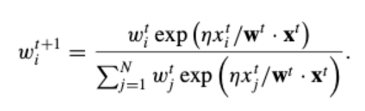
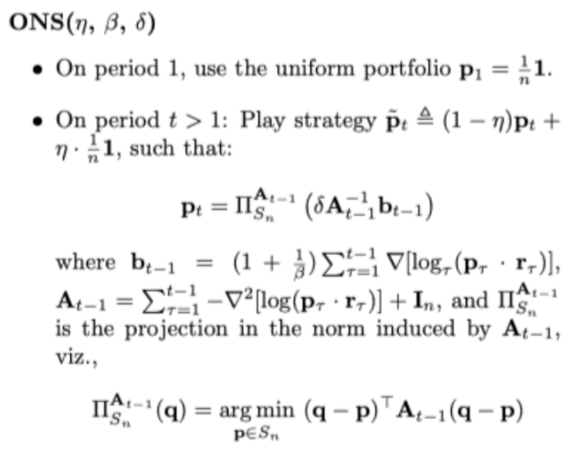

# Fin-Tech
Relevant codes of Fin-Tech taught by Xiaolin Zheng is preserved.

Current available codes include:

* Web-Crawler
  * tutorial code based on **Scrapy** Framework [which I am not familiar with]
  * trivial code based on **Requests** packages [which I prefer] to grasp basic stock information from xueqiu.com
* Clustering-Classification [unfinished]
  * Clustering code including KNN, Spectral Clustering
  * Classification code including Perceptron, Logistic Regression, Linear Regression

* Text-Classification

  * Using Data from *tushare*
  * Vectorizing by means of **TF-IDF** and **word2vec**

* Investment-Portfolio

  * Provide a framework of Portfolio

  * Using cvxopt as optimizer

  * Include 

    * EW (naive version)

      $W = 1/n$

    * MV (*Markowitz mean-variance*) 

      ​														$min \quad W^{T}CW + \alpha \mu^{T}W$

      ​																	$s.t. \sum W_i = 1$

    * EG (*1998 Mathematical Finance EG*)

      

    * ONS (*2006 ICML ONS*)

      

